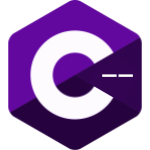

# C--   
C-- is a compiled, simple programming language mostly like C#, C++, and [Carbon](https://github.com/carbon-language/carbon-lang). I work on it in my free time so I can learn the programming languages I need to use faster and better.

## Installation
You can build and install C-- over a Makefile:
```bash
# Make sure you have Git installed
git clone https://github.com/btd2010/cmm
cd cmm
make all

#  Other make targets:
#     make compiler - The compiler's headers. You can import the compiler into C++ using <cminusminus.hpp>
#     make binary   - Command line binaries. Includes the cmm bin.
#     make all      - Everything
#
#     make install  - Installs binaries to /usr/local/bin/, headers to /usr/include/.
```

## Code Sample
> Note: This sample is subject to change.
```rs
#include std

fn main(string args) int {
  if (args[1] == "helloworld") {
    std.print("hello world");
  }

  var printStatement string = "Hello world";
  std.print(printStatement);

  return 0;
}
```

## License
C-- is licensed under GNU General Public License V3.
